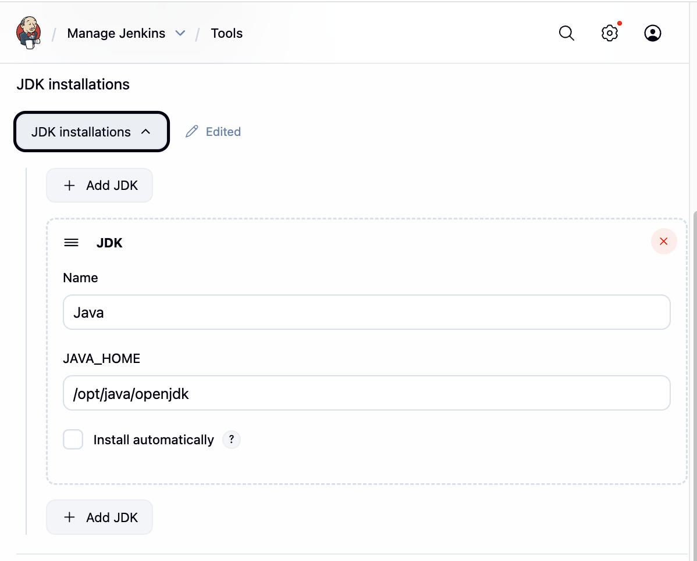
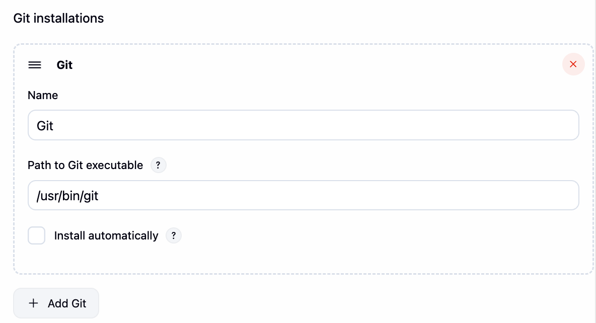
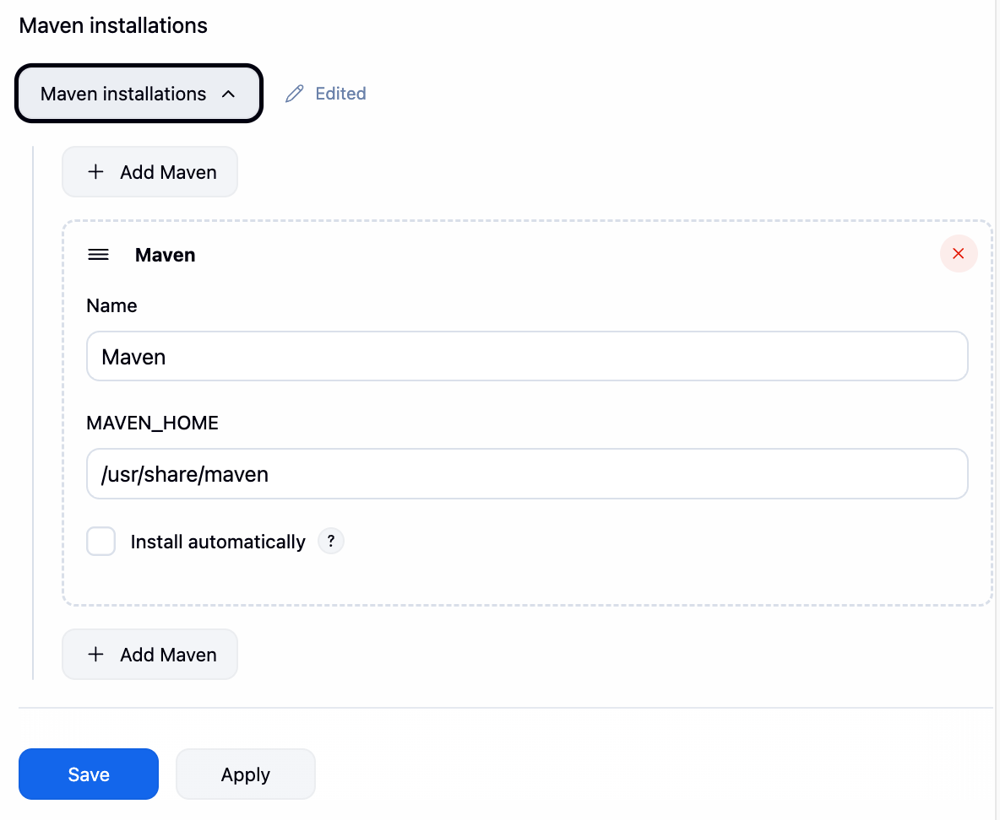
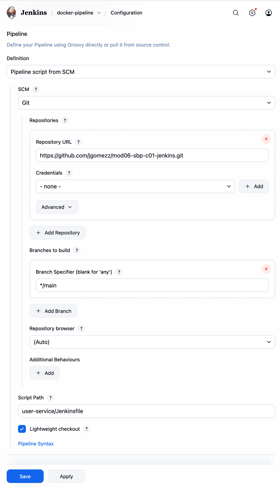
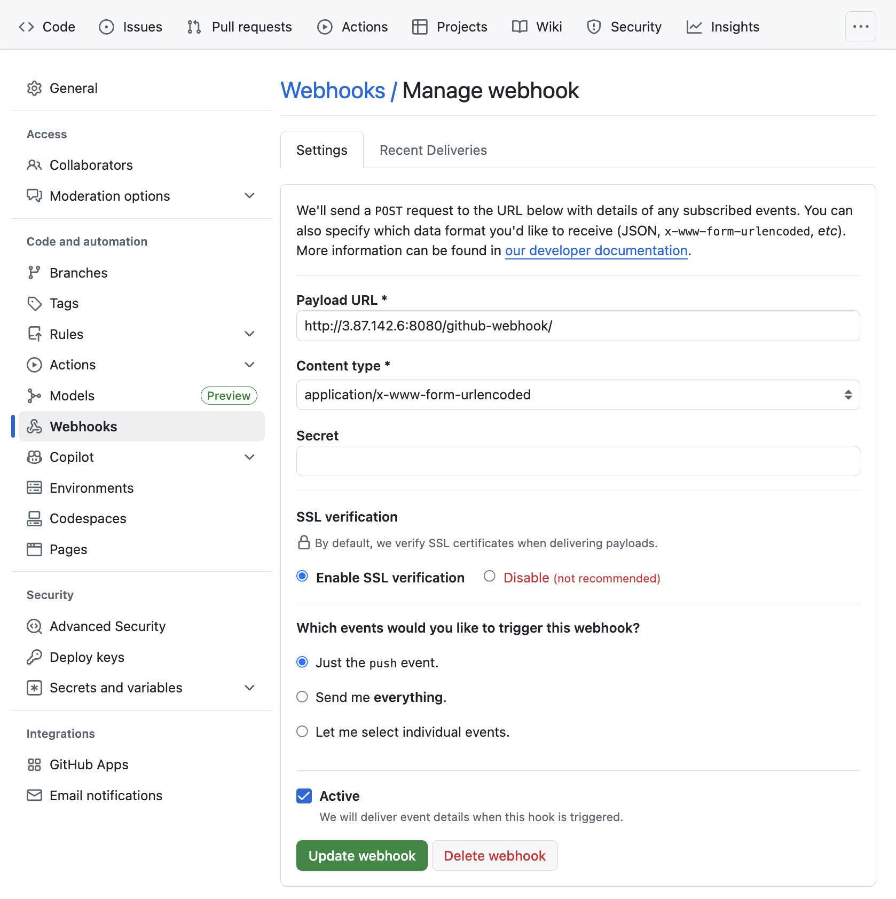
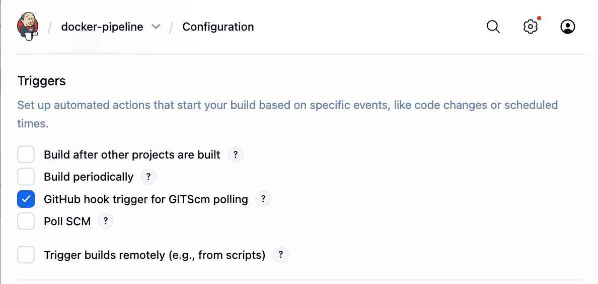

# Chapter I : Basic CI/CD

## PART 1: Launch EC2 Instance

### Step 1: Create EC2
```
- AWS Console → EC2 → Launch Instance
- Configure:
    Name: jenkins-docker
    AMI: Ubuntu Server 22.04 LTS
    Instance type: t2.small (or t2.micro)
    Key pair: Create new jenkins-key
    Security group rules:
        SSH (22) → My IP
        Custom TCP (8080) → Anywhere
- Storage: 20 GB
- Launch
- Get IP address (example: 54.123.45.67)
```

## PART 2: Install Docker & Run Jenkins

### Step 2: Connect to EC2

#### Mac/Linux
```
chmod 400 jenkins-key.pem
ssh -i jenkins-key.pem ubuntu@54.123.45.67
```

### Step 3: Install Docker 

```
# Update system
sudo apt update

# Install Docker
sudo apt install -y docker.io

# Start Docker
sudo systemctl start docker
sudo systemctl enable docker

# Allow ubuntu user to use Docker (no need for sudo)
sudo usermod -aG docker ubuntu

# Apply group changes
newgrp docker

# Verify Docker works
docker --version
```

### Step 4: Run Jenkins Container
```
docker run -d \
  --name jenkins \
  -p 8080:8080 \
  -p 50000:50000 \
  -v jenkins_home:/var/jenkins_home \
  -v /var/run/docker.sock:/var/run/docker.sock \
  --restart unless-stopped \
  jenkins/jenkins:lts-jdk17
```

### Step 5: Get Jenkins Password

#### Get initial password
```
docker exec jenkins cat /var/jenkins_home/secrets/initialAdminPassword
```

### Step 6: Open Jenkins
```
http://54.123.45.67:8080
(use YOUR EC2 IP)
```
```
- Paste password → Continue
- Install suggested plugins → Wait
- Create admin user:
    Username: admin
    Password: admin123
- Start using Jenkins
```

## PART 3: Install Maven & Git in Jenkins Container

### Step 7: Access Jenkins Container
```
docker exec -u root -it jenkins bash
```

### Step 8: Install Tools Inside Container
```
# Update package list
apt-get update

# Install Maven
apt-get install -y maven

# Install Git
apt-get install -y git

# Verify installations
mvn -version
git --version

# Exit container
exit
```

### Step 9: Configure Tools in Jenkins
```
- Manage Jenkins → Tools
- JDK:
    Add JDK
    Name: Java
- Maven:
  Add Maven
  Name: Maven
  Uncheck "Install automatically"
  MAVEN_HOME: /usr/share/maven
- Git:
  Should auto-detect
  Path: /usr/bin/git
- Save
```






## PART 4: Create Simple Spring Boot App (Same as Before)

### Step 10: Create Project

#### File 4: Jenkinsfile
```
pipeline {
    agent any

    tools {
        maven 'Maven'
        jdk 'Java'
        // git 'Git'
    }

    stages {
        stage('Checkout') {
            steps {
                echo '📥 Getting code...'
                checkout scm
            }
        }

        stage('Build') {
            steps {
                echo '🔨 Building...'
                dir('user-service') {  // Change to user-service directory
                    sh 'mvn clean compile'
                }
            }
        }

        stage('Test') {
            steps {
                echo '🧪 Testing...'
                dir('user-service') {  // Change to user-service directory
                    sh 'mvn test'
                }
            }
        }

        stage('Package') {
            steps {
                echo '📦 Creating JAR...'
                dir('user-service') {  // Change to user-service directory
                    sh 'mvn package -DskipTests'
                }
            }
        }
    }

    post {
        success {
            echo '✅ Success in Docker!'
            archiveArtifacts 'user-service/target/*.jar'
        }
        failure {
            echo '❌ Failed!'
        }
    }
}
```

## PART 5: Push to GitHub & Setup Pipeline

### Step 11: Push to GitHub
```

```
### Step 12: Create Pipeline in Jenkins
```
- Jenkins → New Item
- Name: docker-pipeline
- Type: Pipeline
- Configure:
    - Pipeline → Definition: Pipeline script from SCM
    - SCM: Git
    - Repository URL: https://github.com/jgomezz/mod06-sbp-c01-jenkins.git
    - Branch: */main
    - Script Path: Jenkinsfile
- Save
```


### Step 13: Run Build
```
- Click "Build Now"
- Click #1 → Console Output
- Wait for "✅ Success in Docker!"
```

## PART 6: Setup Webhook (Automatic Builds)

### Step 14: GitHub Webhook
```
- GitHub repo → Settings → Webhooks → Add webhook
- Payload URL: http://IP:8080/github-webhook/
- Content type: application/json
- Add webhook
```



### Step 15: Enable in Jenkins
```
- Pipeline → Configure
- Build Triggers:
    ✅ GitHub hook trigger for GITScm polling
- Save
```


### Step 16: Do change, push and build starts automatically!

_

# Chapter II : Advanced CI/CD 

