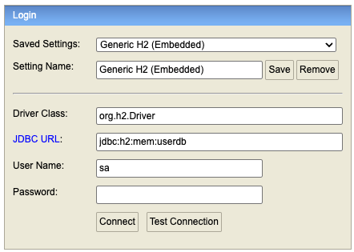

## Docker con Spring Boot

### Configuración de h2-console



### Configuración con Spring Boot

Crear Dockerfile

```declarative
# Base image
FROM eclipse-temurin:17-jdk

# Set working directory
WORKDIR /app

# Copy the JAR file from target directory and rename it to app.jar
COPY target/*.jar user-service.jar

# Expose the port your application uses (change 8080 if needed)
EXPOSE 8081
ENV JAVA_OPTS="-Xms256m -Xmx512m"

# Run the application
ENTRYPOINT ["sh", "-c", "java $JAVA_OPTS -jar user-service.jar"]
```

Crear componente en proyecto en maven
```
mvn clean package
```

Construir imagen
```
docker build -t user-service:1.0 .
```

Ejecutar Container
```
docker run -d --name user-service -p 8081:8081 user-service:1.0
 
```

Ver Container
```
docker ps
docker ps -a
```

Ejecutar comando en el container
```
docker exec -it user-service sh
```

Ver logs
```
docker logs user-service
```

Detener Container
```
docker stop user-service
```

Eliminar Container
```
docker rm user-service
```

Eliminar imagen
```
docker rmi myappjava:1.0
```
